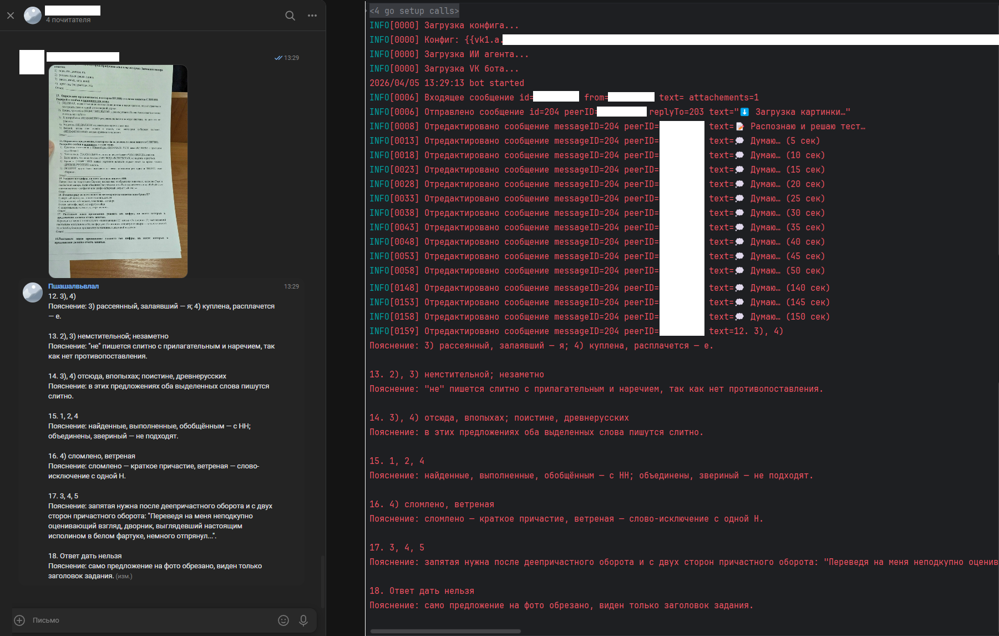

# VK Test Solver Bot (Go)

Бот для VK, который принимает один или несколько снимков одного варианта теста, извлекает структуру заданий и возвращает финальный JSON-ответ с решением.

## Возможности

- Работа через белосписочный VK.
- Приём изображений как `photo` или `doc` (несколько страниц в одном сообщении).
- Двухшаговый пайплайн через OpenAI Responses API:
  - извлечение структуры задач;
  - решение и верификация по исходным изображениям.
- Structured Outputs (JSON Schema) на обоих этапах.
- Валидации на стороне сервера:
  - проверка JSON;
  - запрет LaTeX-маркеров;
  - проверка, что варианты ответа существуют среди извлечённых;
  - `status=unreadable` требует непустой `unreadable_fragments`.
- Retry при `incomplete` из-за `max_output_tokens`.
- Middleware:
  - access-list по `user_id`;
  - ограничение количества одновременных задач на пользователя.
- Пул воркеров для одновременной обработки нескольких запросов.

## Запуск

```bash
go mod tidy
go run ./cmd/bot -config config.yaml
```

## Конфиг

См. `config.example.yaml`.

## Промпты

См. `internal/openaiagent/prompt.go`.

## Пример работы бота


